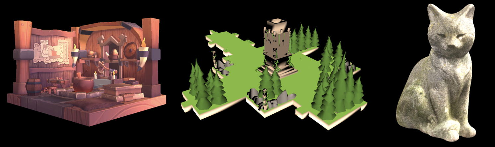

# 3D Software Renderer

## Features
- `glm` was not used for this project. Instead, I created the following:
- - `slib.cpp/hpp` - A helper library. Contains mutliple vector/matrix classes with operators overloaded for convenience.
- - `smath.cpp/hpp` - A maths library. Can generate all necessary matricies for the renderer.
- Model/material loading. `objParser.cpp/hpp` parses and loads `obj` files and their accompanying `mtl` files into the `renderable` class used by the renderer.
- Full rendering pipeline. `renderer.cpp/hpp` takes the 3D model data provided as a `renderable` and puts it through the pipeline to convert it to screen space coordinates.
- Z-Buffer implementation.
- Triangle rasterization. `rasterizer.cpp/hpp` takes the data provided from the renderer and fills the triangle accordingly with the edge-finding algorithm (not scanline).
  - Texturing is implemented and is read from the `mtl` files provided. (Textures must be png files).
  - Two texture filtering algorithms - either nearest neighbour or bilinear filtering.
  - Two shading algorithms - either flat or gouraud shading.
  - Basic directional lighting.
  - Multiple textures are supported.
  - Texture atlases are supported. Can be used with bilinear filtering if atlas 'tiles' are a consistent size.
- A GUI that displays the scene's framerate and allows the user to select from various pre-selected scenes.
- Multithreaded processing thanks to the `opm` library.

## Screenshots

## To Do
- Triangle clipping is currently not implemented. Currently, triangle too close to the camera are just culled to avoid dividing by zero.
- Billinear filtering causes shadows to appear darker (sampling bug).
- Multithreaded rendering causes slight flickering.

## Models Used
- Viking Room by nigelgoh.
- Isometric Game Level Low Poly by Karthik Naidu.
- Concrete Cat statue by Rico Cilliers and Riley Queen